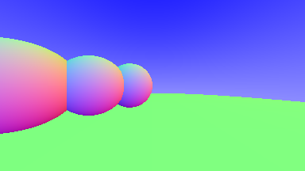
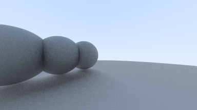
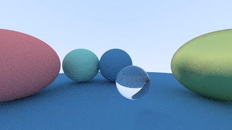
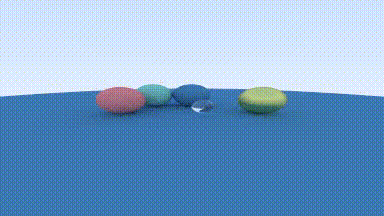
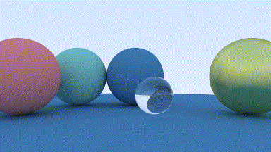
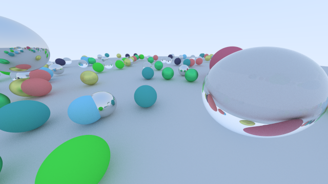
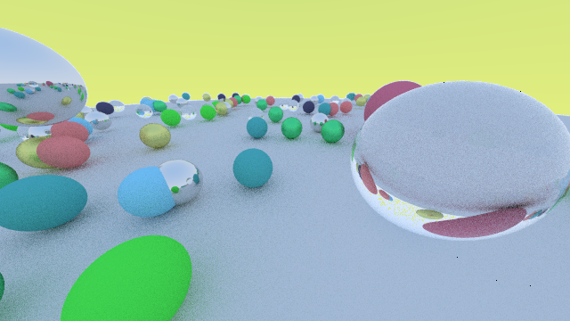

# DIARY.md

## 9c3e40a
DIARY.mdとりどみを作った。自己言及。

## 1a694a4
セイシュンワン！commit hashの自動追記を実装！これでgit logは不要だ！

## 810dcce
DIARY.mdのhookまわりでうっかり消えたcommitであるmainとview.shとを追加、ようやく本題

## 50447cf
りどみのshにデバック用のゴミが残っているの今気づいた、なおした。あんまこのファイルでログ伸ばしたくない。

## 2f8666e
ファイル増加の気配を察知！srcディレクトリ召喚！

## d7c59ec
オアーッ！rayだ！
ray_colorの処理は正規化したrayのyが -1 <= y <= 1だからそれを0<= y <=1になるようにしてる計算なのだな！（ベクトル雑魚）

rayのコンストラクタに関してはviewportの左上からのオフセットだな！座標上では連続な値だけどforで扱うから離散的な点になってるわけじゃ！

## 1af64e6
rayで衝突判定をするぞ！したぞ！
あーん二次方程式や　数学から逃げやがって
- ドット積はベクトルの各要素をかけ合わせた合計だから、円の公式の左辺と等しい
- P(t)に定義を代入する時、どれが何
  - A は、Rayの原点
  - tは移動距離、bが向き

z=+1でも同じ画像ってどういう事？あそうか、ベクトルが触れてればどこでもいいのか

## acc13e9
Hittableを作ったりしたお！現時点でだいぶ3DCGっぽくはあるね
あせっかくだから画像添付するね

## c07f42f
反射をやりだした。ぶつかったら折り返してを繰り返す感じ。

アホほど実行時間がかかるようになってきたので、
コンパイラの最適化オプションをO5にするのと乱数生成をXORShiftに置き換えた。
O5にしたら6倍早くなり、XORShiftにしてﾁｮｯﾄ早くなった。

## 14b1c79
ガラス球って言われたけどそもそもガラス球をあんま手元に持ったことがないからあってるのかわかんねぇ！
数式いまいちよくわかってない。後で見返せ

## 751363f 
カメラを実装したぞ！カメラ位置が難しい！近いとめり込む！

そういえば今コレ焦点距離は何が決めてるんだろう？wは単位ベクトルだから1ってこと？

わかりにくいからカメラが動いてる動画を出力してみた。ffmpeg様々。

## 2d75a4f
なにかおかしいと思ったら、viewportが両方height指定だ！そら画像が横に引き伸ばされてるわけだ！

ところで、さっきの焦点距離の件は原語版では存在してた。翻訳を信用しない方がよさそう。

改めて回転する画像を添付する。
流石に数十フレーム出力すると鳴ると時間がかかる。
openmpを適当に使ってみると約半分まで短縮されたが、それでも数十秒。なんとかならないかな。
あ、ふと思ったけどGIFだと色味劣化するのか…

## 544d58c
レンダリングに時間がかかるのに対して、試しにdoubleをfloatにしてみた。

結果としては、まあ0.5秒くらいは変わるか…？程度だった。コンピューターって難しすぎる

## 2832af2
セイシュンワン！なんとか完走！

この後はRay Tracing: The Next Weekかな？

## c81ad44
ちょっと小休止で高速化を試してみたけど、よくわかんなかった。SIMD二関しては多分私よりGCCの方が賢い。
XORShiftの変数をthread_localにするのが一番高速化されました。

## ac10d89
ムムム？1つ前のcommit、球体の輪郭とかに黒いゴマが出現している。
調べた所、ベクトルの正規化のSIMD命令をコメントアウトしたら消えた。原因がわかったが理由がわからない。不気味だ…

## 384381c
試しに別PCで動かしたら空が黄色くなってしまった。~~諸君、我々は失敗した。~~

どうも、画素出力のための変換（0～1のfloat→0～255の整数）をcharでやったのがまずいみたいだ。
最適化の過程で、charがsigned→128以上にならない→大きい数は決め打ち127ヨシ！ってなったみたい。

さらなる気になるポイントとして、前回のcommitで書いた正規化で現れるゴマについて。
別PCで動かすと確かにゴマが出るものの、場所と量が違う。なんで？

## 0f8d129
セイシュンワン！！お久しぶりやね！

さて、暇だったから ac10d89 のゴマの件を調査した。地道に随所でisnan()してSIGTRAPを飛ばしてはGDBでみる由緒正しきデバッグ。

結果として、sqrt(1-X)って処理をするから1以下になるべき値が、浮動小数点の誤差で1.00038087になってた。refract()関数を参照。
ここからは私の想像になるのですが、単位ベクトルにする処理の時に精度が悪いせいで大きさが1をギリオーバーしているのではないかと……。

原語版を見ると、sqrtにかける前にfabsで無理やり正の数にしてた。
sqrt(fmax(0, X))でも同様に動作するとは思うが、オペランドを取らない分fabsの方が速そう。
どうせ浮動小数点誤差なんでほんのちょっとだから速い方がいいのは正しいと思う。

## 9b1caf9
ヌヌヌ！コードのお掃除をした！
私はclangdの言いなりってわけよ。

## 700d736
ミュ！ BVHをやるよ！一旦AABBから。

テキストとそこにある図を読んでもよくわからなかったので頑張って解釈したんだけど、最終的に自分が理解できた図がテキストにあるのと大して変わらなくて笑ってしまった。

## 37a9453
BVH完成！出力画像に変更はないので画像はない。

画素数320x180で、ピクセルあたりのサンプル数50の時のレンダリング速度が、BVHの実装前が11秒、実装後は3.2秒ということで約4倍の高速化という事になる。
オブジェクトの数がたかだか150しかないので4倍だが、もうちょっと量が多いと劇的に変わりそう、試してないけど。

## b07409a
1つ前のコミットではBVHの分割法を常にx軸で分割するようにしている。
これに気づいてAABBの最長の軸で分割するようにしたら、1秒くらい遅くなった。

考えられる理由としては、そもそもカメラの向きがX軸に平行な向きなのでX軸での分割が有利であること。
いろいろな角度から描画する、ステップ数が増えるなどになるとx軸のみの分割は不利になる（と思う。）

## HEAD
いい加減mainがごちゃごちゃしてきたので、オブジェクトの設置、レンダリング、タイマーで分割した。
やはり画像に変化がなく、つまらない。

